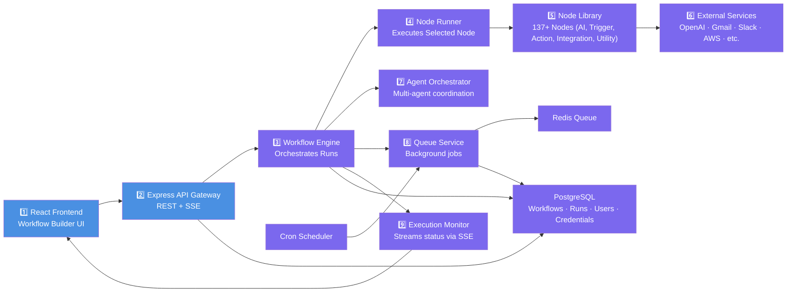
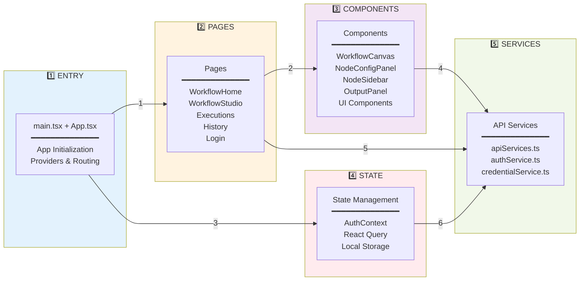
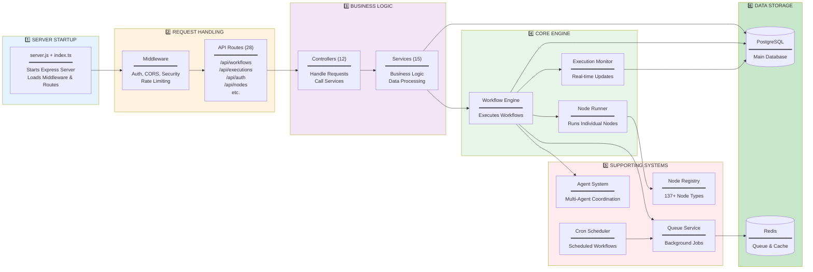
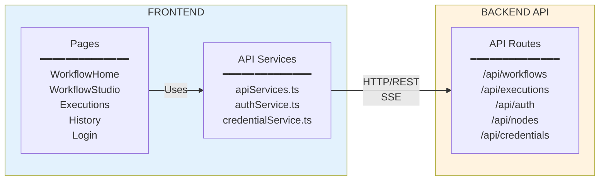
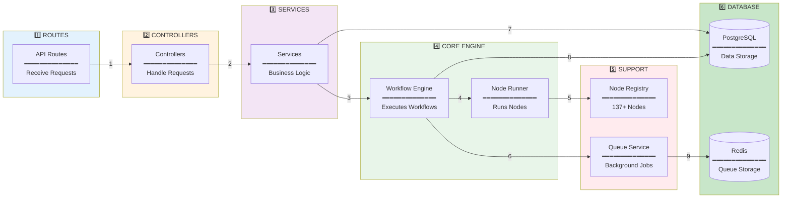
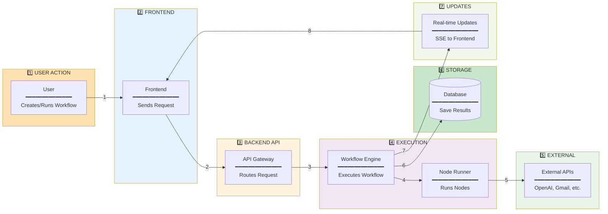
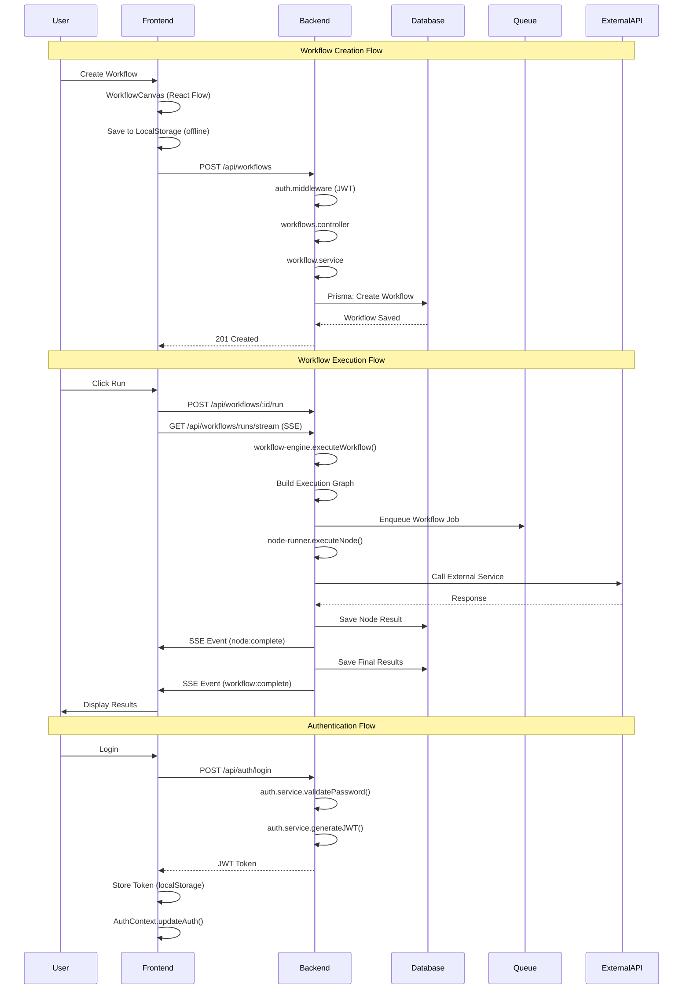

# Frontend & Backend Architecture Diagrams

## 1A. Complete High-Level Architecture (Full System)

## 2. Simplified Frontend Architecture

## 3. Simplified Backend Architecture

## 4. Simplified Frontend to Backend Connections

## 5. Simplified Backend Internal Flow

## 6. Simplified Data Flow

## 7. Frontend-Backend Communication Flow

## 8. Detailed Connection Mapping

### Frontend Component → Backend API Endpoint Mapping

| Frontend Component | Frontend Service | HTTP Method | Backend Route | Backend Controller | Backend Service |
|-------------------|------------------|-------------|---------------|-------------------|-----------------|
| **WorkflowHome.tsx** | apiServices.ts | GET | `/api/workflows` | workflows.controller.getWorkflows() | workflow.service.findMany() |
| **WorkflowHome.tsx** | apiServices.ts | POST | `/api/workflows` | workflows.controller.createWorkflow() | workflow.service.create() |
| **WorkflowHome.tsx** | apiServices.ts | DELETE | `/api/workflows/:id` | workflows.controller.deleteWorkflow() | workflow.service.delete() |
| **WorkflowStudio.tsx** | apiServices.ts | GET | `/api/workflows/:id` | workflows.controller.getWorkflow() | workflow.service.findOne() |
| **WorkflowStudio.tsx** | apiServices.ts | PUT | `/api/workflows/:id` | workflows.controller.updateWorkflow() | workflow.service.update() |
| **WorkflowHeader.tsx** | apiServices.ts | POST | `/api/workflows/:id/run` | workflows.controller.runWorkflow() | workflow-engine.executeWorkflow() |
| **WorkflowExecution.tsx** | apiServices.ts | GET | `/api/workflows/runs/stream` | executions.controller.streamEvents() | execution-monitor.emitEvent() |
| **Executions.tsx** | apiServices.ts | GET | `/api/executions` | executions.controller.getExecutions() | execution.service.findMany() |
| **Executions.tsx** | apiServices.ts | GET | `/api/executions/:id` | executions.controller.getExecution() | execution.service.findOne() |
| **History.tsx** | apiServices.ts | GET | `/api/executions` | executions.controller.getExecutions() | execution.service.findMany() |
| **NodeSidebar.tsx** | nodeService.ts | GET | `/api/nodes` | nodes.controller.getNodes() | node-registry.getAllNodes() |
| **NodeConfigPanel.tsx** | nodeService.ts | GET | `/api/nodes/:type` | nodes.controller.getNodeDefinition() | node-registry.getNode() |
| **CredentialsManager.tsx** | credentialService.ts | GET | `/api/credentials` | credential.controller.getCredentials() | credential.service.findMany() |
| **CredentialsManager.tsx** | credentialService.ts | POST | `/api/credentials` | credential.controller.createCredential() | credential.service.create() |
| **CredentialsManager.tsx** | credentialService.ts | PUT | `/api/credentials/:id` | credential.controller.updateCredential() | credential.service.update() |
| **CredentialsManager.tsx** | credentialService.ts | DELETE | `/api/credentials/:id` | credential.controller.deleteCredential() | credential.service.delete() |
| **LoginPage** | authService.ts | POST | `/api/auth/login` | auth.controller.login() | auth.service.validatePassword() |
| **RegisterPage** | authService.ts | POST | `/api/auth/register` | auth.controller.register() | auth.service.createUser() |
| **OAuthManager.tsx** | apiServices.ts | GET | `/api/auth/oauth/status` | oauth.controller.getStatus() | oauth.service.getConnections() |
| **OAuthManager.tsx** | apiServices.ts | GET | `/api/auth/oauth/:provider` | oauth.controller.initiate() | oauth.service.getAuthUrl() |
| **OAuthManager.tsx** | apiServices.ts | DELETE | `/api/auth/oauth/:provider` | oauth.controller.revoke() | oauth.service.revoke() |

### Backend Service → Service Dependencies

| Service | Calls/Dependencies | Purpose |
|---------|-------------------|---------|
| **workflow.service.ts** | `prisma.workflow.*` | Database operations for workflows |
| **workflow.service.ts** | `validators.ts` | Input validation |
| **execution.service.ts** | `prisma.workflowRun.*` | Database operations for runs |
| **execution.service.ts** | `prisma.workflowRunEvent.*` | Database operations for events |
| **auth.service.ts** | `prisma.user.*` | Database operations for users |
| **auth.service.ts** | `bcrypt` | Password hashing |
| **auth.service.ts** | `jsonwebtoken` | JWT token generation |
| **credential.service.ts** | `encryption.ts` | Encrypt/decrypt credentials |
| **credential.service.ts** | `prisma.credential.*` | Database operations for credentials |
| **workflow-engine.ts** | `node-runner.ts` | Execute individual nodes |
| **workflow-engine.ts** | `execution-monitor.ts` | Emit execution events |
| **workflow-engine.ts** | `queue-service.ts` | Enqueue background jobs |
| **workflow-engine.ts** | `node-registry.ts` | Get node definitions |
| **workflow-engine.ts** | `agent-orchestrator.ts` | Coordinate agent nodes |
| **node-runner.ts** | `node-registry.ts` | Get node implementation |
| **node-runner.ts** | `credential-helper.ts` | Load node credentials |
| **node-runner.ts** | External APIs | Call external services (OpenAI, Gmail, etc.) |
| **execution-monitor.ts** | `prisma.workflowRunEvent.*` | Save events to database |
| **execution-monitor.ts** | SSE Stream | Send real-time events to frontend |
| **queue-service.ts** | `redis.ts` | Store jobs in Redis |
| **queue-service.ts** | `worker.ts` | Process background jobs |
| **worker.ts** | `workflow-engine.ts` | Execute workflows in background |
| **cron-scheduler.ts** | `queue-service.ts` | Enqueue scheduled workflows |
| **cron-scheduler.ts** | `prisma.workflow.*` | Load active workflows |
| **agent-orchestrator.ts** | `memory-manager.ts` | Store agent memory |
| **agent-orchestrator.ts** | `coordination-service.ts` | Coordinate multi-agent tasks |
| **memory-manager.ts** | `vector-storage.ts` | Store vector embeddings |
| **memory-manager.ts** | `embedding-service.ts` | Generate embeddings |
| **webhook-manager.ts** | `workflow-engine.ts` | Trigger workflows from webhooks |
| **webhook-manager.ts** | `prisma.webhook.*` | Load webhook configurations |

### Database Table Access Patterns

| Service/Component | Database Tables | Operations |
|------------------|----------------|------------|
| **workflow.service.ts** | `workflows` | CREATE, READ, UPDATE, DELETE |
| **execution.service.ts** | `workflow_runs` | CREATE, READ, UPDATE |
| **execution.service.ts** | `workflow_run_events` | CREATE, READ |
| **auth.service.ts** | `users` | CREATE, READ, UPDATE |
| **credential.service.ts** | `credentials` | CREATE, READ, UPDATE, DELETE |
| **orchestration.service.ts** | `agents` | CREATE, READ, UPDATE, DELETE |
| **orchestration.service.ts** | `agent_runs` | CREATE, READ, UPDATE |
| **memory.service.ts** | (Vector DB) | CREATE, READ, SEARCH |
| **webhook-manager.ts** | `webhooks` | READ |
| **webhook-manager.ts** | `webhook_events` | CREATE, READ |
| **cron-scheduler.ts** | `workflows` | READ (filter: isActive=true) |
| **analytics.service.ts** | `analytics` | CREATE, READ |
| **audit-logs.service.ts** | `audit_logs` | CREATE, READ |

### External API Connections

| Node Type | External Service | Connection Method |
|-----------|-----------------|-------------------|
| **OpenAI Node** | OpenAI API | HTTP REST (axios) |
| **OpenRouter Node** | OpenRouter API | HTTP REST (axios) |
| **Gmail Node** | Gmail API | Google API Client |
| **Slack Node** | Slack API | @slack/web-api |
| **Discord Node** | Discord API | discord.js |
| **Telegram Node** | Telegram API | node-telegram-bot-api |
| **WhatsApp Node** | WhatsApp | whatsapp-web.js |
| **AWS S3 Node** | AWS S3 | @aws-sdk/client-s3 |
| **Google Drive Node** | Google Drive API | Google API Client |
| **Stripe Node** | Stripe API | stripe SDK |
| **HTTP Node** | Any HTTP API | axios |
| **Database Node** | PostgreSQL | pg (connection pool) |

## 9. Component Details Reference

### Frontend Key Files

#### Entry & Configuration
- **main.tsx**: React app entry point, renders App component
- **App.tsx**: Main app component with providers (QueryClient, Auth, Router)
- **config.ts**: API configuration, base URLs, environment variables

#### Pages (9 pages)
- **WorkflowHome.tsx**: Workflow list, create/delete, execution status
- **WorkflowStudio.tsx**: Main workflow editor page
- **Executions.tsx**: Execution history and details
- **History.tsx**: Past execution results
- **OAuthManager.tsx**: OAuth connection management
- **LoginPage/RegisterPage**: Authentication UI
- **GoogleOAuthCallback.tsx**: OAuth callback handler
- **NotFound.tsx**: 404 page

#### Workflow Components
- **WorkflowCanvas.tsx**: React Flow canvas for visual workflow editing
- **NodeConfigPanel.tsx**: Node configuration and parameter input
- **NodeSidebar.tsx**: Node library with drag & drop
- **OutputPanel.tsx**: Execution results display
- **WorkflowHeader.tsx**: Save, delete, run controls
- **WorkflowDashboard.tsx**: Workflow overview and statistics
- **WorkflowExecution.tsx**: Execution hook and SSE handling

#### Node Components (4 types)
- **TriggerNode.tsx**: Schedule, webhook, manual triggers
- **AINode.tsx**: OpenAI, OpenRouter, LLM operations
- **ActionNode.tsx**: HTTP, database, file operations
- **UtilityNode.tsx**: Data transform, logic operations

#### Services & Libraries
- **apiServices.ts**: HTTP client, API calls, error handling
- **authService.ts**: Authentication, token management
- **credentialService.ts**: Credential CRUD operations
- **nodeService.ts**: Node definitions and metadata
- **workflowStorage.ts**: Local storage persistence
- **executor.ts**: Workflow execution logic
- **n8n-schema-adapter.ts**: n8n schema conversion

#### UI Components (50+ shadcn/ui)
- Button, Dialog, Form, Input, Select, Toast, Alert, Card, Table, etc.

### Backend Key Files

#### Entry Point
- **server.js**: Bootstrap script, ts-node registration
- **index.ts**: Express app setup, middleware, routes, server initialization

#### Routes (28 route files)
- **auth.routes.ts**: Authentication endpoints
- **workflows.routes.ts**: Workflow CRUD and execution
- **executions.routes.ts**: Execution history and streaming
- **nodes.routes.ts**: Node definitions and execution
- **agent.routes.ts**: Agent management
- **credentials.routes.ts**: Credential management
- **oauth.routes.ts**: OAuth integration
- Plus 21 more route files for various features

#### Controllers (12 controllers)
- **auth.controller.ts**: Login, register, token refresh
- **workflows.controller.ts**: Workflow CRUD operations
- **executions.controller.ts**: Execution management
- **nodes.controller.ts**: Node operations
- **orchestration.controller.ts**: Agent orchestration
- **credential.controller.ts**: Credential management
- Plus 6 more controllers

#### Services (15 services)
- **workflow.service.ts**: Workflow business logic
- **execution.service.ts**: Execution management
- **auth.service.ts**: Authentication logic
- **orchestration.service.ts**: Agent orchestration
- **credential.service.ts**: Credential encryption
- **memory.service.ts**: Agent memory management
- Plus 9 more services

#### Core Engine
- **workflow-engine.ts**: Main workflow execution engine
- **node-runner.ts**: Individual node execution
- **execution-monitor.ts**: Execution tracking and SSE
- **agent-orchestrator.ts**: Multi-agent coordination
- **coordination-service.ts**: Agent communication
- **workflow-manager.ts**: Workflow state management

#### Node System
- **node-registry.ts**: Central node registry
- **137+ node files** organized in categories:
  - AI nodes (13): OpenAI, OpenRouter, LLM operations
  - Trigger nodes (15): Schedule, webhook, email triggers
  - Action nodes (10): HTTP, database, file operations
  - Utility nodes (9): Transform, logic, data processing
  - Integration nodes (7): Gmail, Slack, Discord, etc.
  - Core nodes (13): Basic workflow operations
  - Data nodes (10): CSV, JSON, Excel processing
  - Plus more categories

#### Queue & Scheduler
- **queue-service.ts**: BullMQ queue management
- **worker.ts**: Background job processing
- **cron-scheduler.ts**: Scheduled workflow execution

#### Database
- **prisma.ts**: Prisma ORM client
- **database.ts**: PostgreSQL connection pool
- **redis.ts**: Redis client connection

#### Utilities
- **logger.ts**: Winston logging
- **error-handler.ts**: Error processing
- **encryption.ts**: AES encryption
- **validators.ts**: Input validation

