# Workflow Studio - High-Level Architecture Diagram

## 1. High-Level System Overview

```mermaid
graph TB
    subgraph CLIENT["🌐 CLIENT LAYER"]
        UI["React Frontend<br/>━━━━━━━━━━━━━━<br/>• Vite + TypeScript<br/>• React Flow Canvas<br/>• Real-time UI Updates"]
    end

    subgraph API_LAYER["🔌 API GATEWAY LAYER"]
        API["Express.js Backend<br/>━━━━━━━━━━━━━━<br/>Port: 3003<br/>REST API + SSE"]
        MIDDLEWARE["Middleware Stack<br/>━━━━━━━━━━━━━━<br/>• JWT Auth<br/>• Rate Limiting<br/>• CORS<br/>• Helmet Security"]
    end

    subgraph CORE["⚙️ CORE EXECUTION LAYER"]
        WF_ENGINE["Workflow Engine<br/>━━━━━━━━━━━━━━<br/>Execution Orchestrator"]
        NODE_RUNNER["Node Runner<br/>━━━━━━━━━━━━━━<br/>Individual Node Executor"]
        AGENT_ORCH["Agent Orchestrator<br/>━━━━━━━━━━━━━━<br/>Multi-Agent Coordination"]
    end

    subgraph NODES["📦 NODE REGISTRY (137+ Nodes)"]
        NODE_REG["Node Registry<br/>━━━━━━━━━━━━━━<br/>Central Registry"]
        AI_NODES["AI/LLM Nodes<br/>OpenAI, OpenRouter"]
        TRIG_NODES["Trigger Nodes<br/>Schedule, Webhook, Email"]
        ACT_NODES["Action Nodes<br/>HTTP, DB, File Ops"]
        UTIL_NODES["Utility Nodes<br/>Transform, Logic"]
        INT_NODES["Integration Nodes<br/>Gmail, Slack, Discord"]
    end

    subgraph DATA["💾 DATA LAYER"]
        DB[("PostgreSQL<br/>━━━━━━━━━━━━━━<br/>Prisma ORM")]
        REDIS[("Redis<br/>━━━━━━━━━━━━━━<br/>Queue & Cache")]
    end

    subgraph QUEUE_SYS["🔄 BACKGROUND PROCESSING"]
        QUEUE["BullMQ Queue<br/>Job Processing"]
        WORKER["Queue Workers<br/>Background Jobs"]
        SCHEDULER["Cron Scheduler<br/>Scheduled Workflows"]
    end

    subgraph MEMORY["🧠 MEMORY & VECTOR STORAGE"]
        MEMORY_MGR["Memory Manager<br/>Agent Memory"]
        VECTOR_STORE["Vector Storage<br/>Embeddings & Search"]
    end

    subgraph EXTERNAL["🌍 EXTERNAL SERVICES"]
        OPENAI["OpenAI API"]
        OPENROUTER["OpenRouter API"]
        GMAIL["Gmail API"]
        SLACK["Slack API"]
        DISCORD["Discord API"]
        GOOGLE["Google Services"]
        AWS["AWS S3"]
    end

    subgraph EVENTS["📡 EVENT SYSTEM"]
        WEBHOOK["Webhook Manager"]
        SSE["Server-Sent Events<br/>Real-time Updates"]
    end

    subgraph SECURITY["🔐 SECURITY"]
        CRED_STORE["Credential Storage<br/>Encrypted"]
        OAUTH_SVC["OAuth Service"]
    end

    %% Main Flow
    UI -->|HTTP/REST| API
    UI -->|SSE Stream| SSE
    API --> MIDDLEWARE
    MIDDLEWARE --> WF_ENGINE
    WF_ENGINE --> NODE_RUNNER
    NODE_RUNNER --> NODE_REG
    
    %% Node Categories
    NODE_REG --> AI_NODES
    NODE_REG --> TRIG_NODES
    NODE_REG --> ACT_NODES
    NODE_REG --> UTIL_NODES
    NODE_REG --> INT_NODES

    %% Database Connections
    API --> DB
    WF_ENGINE --> DB
    AGENT_ORCH --> DB
    QUEUE --> DB

    %% Queue System
    WF_ENGINE --> QUEUE
    QUEUE --> REDIS
    WORKER --> REDIS
    SCHEDULER --> QUEUE
    SCHEDULER --> REDIS

    %% Agent System
    WF_ENGINE --> AGENT_ORCH
    AGENT_ORCH --> MEMORY_MGR
    MEMORY_MGR --> VECTOR_STORE

    %% External APIs
    AI_NODES --> OPENAI
    AI_NODES --> OPENROUTER
    INT_NODES --> GMAIL
    INT_NODES --> SLACK
    INT_NODES --> DISCORD
    INT_NODES --> GOOGLE
    ACT_NODES --> AWS

    %% Events
    API --> WEBHOOK
    WEBHOOK --> WF_ENGINE
    WF_ENGINE --> SSE
    SSE --> UI

    %% Security
    API --> CRED_STORE
    API --> OAUTH_SVC
    OAUTH_SVC --> GOOGLE

    %% Styling
    style UI fill:#4A90E2,color:#fff
    style API fill:#F5A623,color:#fff
    style WF_ENGINE fill:#7B68EE,color:#fff
    style DB fill:#50C878,color:#fff
    style REDIS fill:#DC143C,color:#fff
    style NODE_REG fill:#9B59B6,color:#fff
    style AGENT_ORCH fill:#E74C3C,color:#fff
```

## 2. Detailed Component Architecture

```mermaid
graph LR
    subgraph FRONTEND["Frontend Application"]
        direction TB
        UI_COMP["UI Components<br/>━━━━━━━━━━━━━━<br/>• WorkflowCanvas<br/>• NodeConfigPanel<br/>• OutputPanel"]
        STATE_MGR["State Management<br/>━━━━━━━━━━━━━━<br/>• React Query<br/>• Local Storage"]
        AUTH_CTX["Auth Context<br/>JWT Management"]
    end

    subgraph BACKEND["Backend Services"]
        direction TB
        ROUTES["API Routes<br/>━━━━━━━━━━━━━━<br/>• /api/workflows<br/>• /api/executions<br/>• /api/agents"]
        CONTROLLERS["Controllers<br/>━━━━━━━━━━━━━━<br/>• workflows.controller<br/>• executions.controller<br/>• agents.controller"]
        SERVICES["Services Layer<br/>━━━━━━━━━━━━━━<br/>• workflow.service<br/>• execution.service<br/>• orchestration.service"]
    end

    subgraph ENGINE["Workflow Engine"]
        direction TB
        ENGINE_CORE["Engine Core<br/>━━━━━━━━━━━━━━<br/>• Graph Builder<br/>• Topological Sort<br/>• Execution Order"]
        EXEC_MONITOR["Execution Monitor<br/>━━━━━━━━━━━━━━<br/>• Status Tracking<br/>• Error Handling<br/>• Retry Logic"]
        STATE_MGR_BE["State Manager<br/>━━━━━━━━━━━━━━<br/>• Workflow State<br/>• Node Results<br/>• Data Flow"]
    end

    subgraph NODE_SYSTEM["Node System"]
        direction TB
        REGISTRY["Node Registry<br/>137+ Node Types"]
        NODE_TYPES["Node Categories<br/>━━━━━━━━━━━━━━<br/>• AI (13 nodes)<br/>• Triggers (15 nodes)<br/>• Actions (10 nodes)<br/>• Utilities (9 nodes)<br/>• Integrations (7 nodes)"]
        NODE_EXEC["Node Executor<br/>━━━━━━━━━━━━━━<br/>• Parameter Validation<br/>• Credential Loading<br/>• API Calls"]
    end

    subgraph STORAGE["Storage Layer"]
        direction TB
        POSTGRES["PostgreSQL<br/>━━━━━━━━━━━━━━<br/>• workflows<br/>• workflow_runs<br/>• agents<br/>• credentials"]
        REDIS_STORE["Redis<br/>━━━━━━━━━━━━━━<br/>• Job Queue<br/>• Cache<br/>• Session Store"]
    end

    FRONTEND -->|HTTP Requests| BACKEND
    BACKEND --> ENGINE
    ENGINE --> NODE_SYSTEM
    ENGINE --> STORAGE
    NODE_SYSTEM --> STORAGE

    style FRONTEND fill:#E3F2FD
    style BACKEND fill:#FFF3E0
    style ENGINE fill:#F3E5F5
    style NODE_SYSTEM fill:#E8F5E9
    style STORAGE fill:#FFEBEE
```

## 3. Data Flow Diagram

## 4. Node System Architecture

```mermaid
graph TB
    subgraph REGISTRY["Node Registry System"]
        REG["Node Registry<br/>━━━━━━━━━━━━━━<br/>Central Registry<br/>137+ Nodes"]
    end

    subgraph AI_CAT["🤖 AI Nodes (13 nodes)"]
        OPENAI_NODE["OpenAI Node"]
        OPENROUTER_NODE["OpenRouter Node"]
        LLM_NODE["LLM Node"]
        EMBED_NODE["Embedding Node"]
    end

    subgraph TRIG_CAT["⚡ Trigger Nodes (15 nodes)"]
        SCHEDULE_NODE["Schedule Node"]
        WEBHOOK_NODE["Webhook Node"]
        EMAIL_TRIG["Email Trigger"]
        MANUAL_TRIG["Manual Trigger"]
    end

    subgraph ACT_CAT["🎯 Action Nodes (10 nodes)"]
        HTTP_NODE["HTTP Request"]
        DB_NODE["Database Node"]
        FILE_NODE["File Operations"]
        TRANSFORM_NODE["Data Transform"]
    end

    subgraph INT_CAT["🔗 Integration Nodes (7 nodes)"]
        GMAIL_NODE["Gmail Node"]
        SLACK_NODE["Slack Node"]
        DISCORD_NODE["Discord Node"]
        TELEGRAM_NODE["Telegram Node"]
    end

    subgraph UTIL_CAT["🛠️ Utility Nodes (9 nodes)"]
        CODE_NODE["Code Node"]
        FUNCTION_NODE["Function Node"]
        SWITCH_NODE["Switch Node"]
        MERGE_NODE["Merge Node"]
    end

    REG --> AI_CAT
    REG --> TRIG_CAT
    REG --> ACT_CAT
    REG --> INT_CAT
    REG --> UTIL_CAT

    style REG fill:#9B59B6,color:#fff
    style AI_CAT fill:#3498DB,color:#fff
    style TRIG_CAT fill:#E74C3C,color:#fff
    style ACT_CAT fill:#2ECC71,color:#fff
    style INT_CAT fill:#F39C12,color:#fff
    style UTIL_CAT fill:#95A5A6,color:#fff
```

## 5. Database Schema Overview

## 6. Deployment Architecture

```mermaid
graph TB
    subgraph INTERNET["Internet"]
        USERS["Users"]
    end

    subgraph PROXY["Reverse Proxy Layer"]
        LB["Load Balancer / Nginx<br/>━━━━━━━━━━━━━━<br/>SSL Termination<br/>Request Routing"]
    end

    subgraph APP_LAYER["Application Layer"]
        FRONTEND_APP["Frontend (Static)<br/>━━━━━━━━━━━━━━<br/>Vite Build<br/>React SPA"]
        BACKEND_APP["Backend API<br/>━━━━━━━━━━━━━━<br/>Express.js<br/>Port 3003"]
    end

    subgraph DATA_LAYER["Data Layer"]
        POSTGRES_DB[("PostgreSQL<br/>━━━━━━━━━━━━━━<br/>Primary Database<br/>Prisma ORM")]
        REDIS_DB[("Redis<br/>━━━━━━━━━━━━━━<br/>Queue & Cache")]
    end

    subgraph EXTERNAL_SERVICES["External Services"]
        EXT_APIS["External APIs<br/>━━━━━━━━━━━━━━<br/>OpenAI, Gmail, Slack<br/>Discord, AWS, etc."]
    end

    USERS -->|HTTPS| LB
    LB -->|HTTP| FRONTEND_APP
    LB -->|HTTP| BACKEND_APP
    BACKEND_APP --> POSTGRES_DB
    BACKEND_APP --> REDIS_DB
    BACKEND_APP --> EXT_APIS

    style LB fill:#FF6B6B,color:#fff
    style FRONTEND_APP fill:#4ECDC4,color:#fff
    style BACKEND_APP fill:#45B7D1,color:#fff
    style POSTGRES_DB fill:#96CEB4,color:#fff
    style REDIS_DB fill:#FFEAA7,color:#000
```

## Component Breakdown

### 1. Frontend (React Application)
- **Technology**: React 18, TypeScript, Vite
- **UI Framework**: Radix UI, Tailwind CSS, shadcn/ui
- **Key Features**:
  - Visual workflow canvas using React Flow
  - Real-time workflow execution monitoring
  - Node configuration panels
  - Credential management
  - OAuth integration UI
  - Workflow history and analytics

### 2. Backend API (Express.js)
- **Technology**: Node.js, Express, TypeScript
- **Port**: 3003 (default)
- **Key Features**:
  - RESTful API endpoints
  - Server-Sent Events (SSE) for real-time updates
  - JWT authentication
  - Rate limiting and security middleware
  - CORS configuration

### 3. Workflow Engine
- **Core Components**:
  - Workflow Engine: Orchestrates workflow execution
  - Node Runner: Executes individual nodes
  - Execution Monitor: Tracks workflow runs
  - State Manager: Manages workflow state

### 4. Node System
- **137+ Node Types** organized into categories:
  - **AI Nodes**: OpenAI, OpenRouter, LLM operations
  - **Trigger Nodes**: Schedule, Webhook, Email triggers
  - **Action Nodes**: HTTP requests, database operations, file operations
  - **Utility Nodes**: Data transformation, logic operations
  - **Integration Nodes**: Gmail, Slack, Discord, Telegram, WhatsApp
  - **Cloud Nodes**: AWS S3, Google Drive operations
  - **Data Nodes**: CSV, JSON, Excel processing

### 5. Database (PostgreSQL)
- **ORM**: Prisma
- **Key Tables**:
  - `users`: User accounts and authentication
  - `workflows`: Workflow definitions (nodes, edges, settings)
  - `workflow_runs`: Execution history and results
  - `workflow_run_events`: Real-time execution events
  - `agents`: AI agent configurations
  - `agent_runs`: Agent execution history
  - `credentials`: Encrypted credential storage
  - `webhooks`: Webhook configurations
  - `email_data`: Email automation data
  - `audit_logs`: System audit trail

### 6. Queue System (BullMQ + Redis)
- **Purpose**: Background job processing
- **Features**:
  - Async workflow execution
  - Retry mechanisms
  - Priority queues
  - Job scheduling

### 7. Scheduler (Cron)
- **Purpose**: Scheduled workflow execution
- **Features**:
  - Cron-based scheduling
  - Recurring workflows
  - Time-based triggers

### 8. Memory & Vector Storage
- **Purpose**: Agent memory and context
- **Features**:
  - Long-term memory for agents
  - Vector embeddings for semantic search
  - Context management

### 9. External Integrations
- **AI Services**: OpenAI, OpenRouter
- **Communication**: Gmail, Slack, Discord, Telegram, WhatsApp
- **Cloud Storage**: AWS S3, Google Drive
- **Other**: Stripe (payments), Google OAuth

### 10. Security
- **Authentication**: JWT tokens
- **Credentials**: AES encryption at rest
- **OAuth**: Provider-based authentication
- **Rate Limiting**: API protection
- **CORS**: Cross-origin security

## Data Flow

### Workflow Execution Flow
1. User creates/edits workflow in frontend
2. Frontend sends workflow definition to backend API
3. Backend validates and stores workflow in database
4. User triggers workflow execution
5. Workflow Engine loads workflow from database
6. Engine builds execution graph from nodes and edges
7. Node Runner executes nodes in topological order
8. Each node may call external APIs or process data
9. Results are stored in database
10. Real-time events sent via SSE to frontend
11. Frontend updates UI with execution status

### Agent Execution Flow
1. User creates agent configuration
2. Agent Orchestrator manages agent lifecycle
3. Coordination Service handles multi-agent communication
4. Memory Manager stores agent context
5. Vector Storage enables semantic memory retrieval
6. Results stored in agent_runs table

## Technology Stack Summary

### Frontend
- React 18.3
- TypeScript 5.8
- Vite 5.4
- React Flow (workflow canvas)
- Radix UI + Tailwind CSS
- React Query (data fetching)
- React Router (routing)

### Backend
- Node.js 18+
- Express.js 4.18
- TypeScript 5.9
- Prisma 5.22 (ORM)
- PostgreSQL (database)
- Redis (queue/cache)
- BullMQ 5.61 (job queue)
- Node-cron 3.0 (scheduling)
- Socket.io 4.7 (real-time)

### External Services
- OpenAI API
- OpenRouter API
- Gmail API
- Slack API
- Discord.js
- Telegram Bot API
- WhatsApp Web.js
- AWS SDK
- Stripe API
- Google APIs

## Key Features

1. **Visual Workflow Builder**: Drag-and-drop interface for creating workflows
2. **137+ Pre-built Nodes**: Extensive library of integration nodes
3. **AI Agent Support**: Multi-agent coordination and orchestration
4. **Real-time Execution**: Live monitoring of workflow runs
5. **Scheduled Workflows**: Cron-based scheduling
6. **Webhook Support**: Incoming webhook triggers
7. **Credential Management**: Secure, encrypted credential storage
8. **OAuth Integration**: Provider-based authentication
9. **Vector Memory**: Semantic search for agent context
10. **Audit Logging**: Comprehensive audit trail

## Environment Configuration

### Backend (.env)
- `DATABASE_URL`: PostgreSQL connection string
- `REDIS_URL`: Redis connection string
- `JWT_SECRET`: JWT signing secret
- `OPENAI_API_KEY`: OpenAI API key
- `OPENROUTER_API_KEY`: OpenRouter API key
- `CORS_ORIGIN`: Allowed CORS origins
- `PORT`: Server port (default: 3003)

### Frontend (.env)
- `VITE_BACKEND_URL`: Backend API URL (default: http://localhost:3003)

